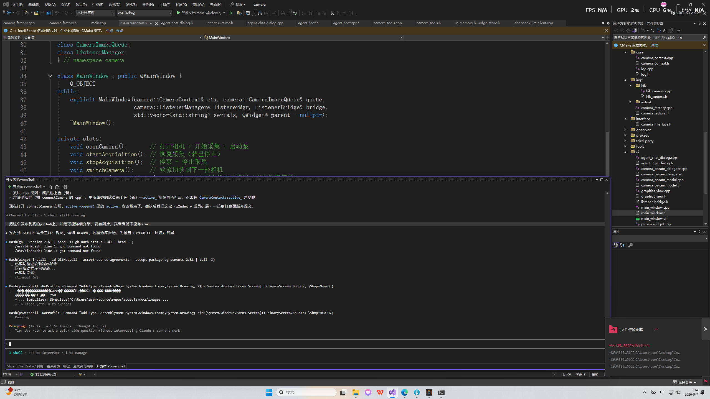
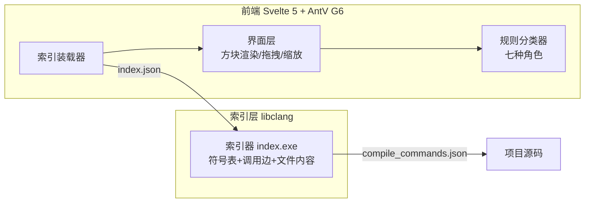

# CodeViz —— 可交互的 C++ 代码可视化工具

> 把代码库变成一张**可点击、可拖拽、可探索的图**：每个类是一块真实代码，每个符号都是跳转入口。基于 **libclang 真实语义索引**，不需要 LLM。



[](LICENSE)
[](https://svelte.dev)
[](https://clang.llvm.org)
[](https://g6.antv.antgroup.com)

## ✨ 特性

- **代码块即节点**：每个类/函数是一块真实源代码（声明+实现），不是圆圈或抽象框
- **真实语义索引**：libclang 解析，配合 `compile_commands.json` 精度拉满；没有也能用（降级模式）
- **五种符号一键跳转**：类名、函数、成员变量、全局变量、局部变量/参数——点击即在鼠标处弹出定义框
- **引用线从词出发**：箭头精确从你点击的那个单词连到目标（同名多次出现也分得清）
- **规则分类器（零 LLM）**：语法信号 + 命名约定 + 图论特征三路打分，自动识别七种类角色（流程/接口/实现/工具/管理/数据结构/桥接），置信度低标虚线
- **主干+卫星心智**：从 `main` 入口逐级展开，函数实现按需弹出
- **文件树**：右侧完整文件列表（头文件/实现/其他图标区分），点击看全文
- **丝滑交互**：拖动重排、点击置顶、滚轮全局缩放（框内也生效）、连带关闭
- **双击即用的桌面版**：PyInstaller 打包，用户机器零依赖（Windows 10/11）

## 📸 截图

| 主界面 | 符号跳转 |
|---|---|
|  | （截图 2 占位，`Win+Shift+S` 截一张点开类的画面后替换） |

## 🏗 架构



**数据流**：`index.exe <项目目录>` → `index.json`（含全部文件内容+符号表+调用边）→ 网页"导入索引" → 图渲染。前后端通过一个 JSON 文件解耦，索引器可独立升级（换 clangd 也只需换它）。

## 🛠 技术栈

| 层 | 选型 | 说明 |
|---|---|---|
| 前端框架 | Svelte 5 + Vite 6 | 编译时框架，图交互零运行时开销 |
| 图渲染 | AntV G6 5.1 | HTML 节点 + SVG 覆盖层箭头 |
| 代码解析 | libclang 18（Python 绑定） | 编译器级语义：重载/继承/调用关系 |
| 分类 | 纯规则打分 | 语法+命名+图论，无 LLM |
| 桌面打包 | PyInstaller | 启动器 + 索引器双 exe |

## 🚀 快速开始

### 开发模式

```bash
npm install
npm run dev        # http://localhost:5173（内置 camera 项目样例索引）
```

### 桌面版

从 Release 下载 `CodeViz.zip`（约 45MB），解压双击 `CodeViz.exe`——浏览器自动打开界面，无需安装任何环境。

### 看自己的项目

```bash
index.exe <项目目录> index.json
# 网页点【导入索引】选择 index.json
```

## 🎮 操作指南

| 操作 | 效果 |
|---|---|
| 点击彩色类名 | 打开类方块（头文件视图，.h/.cpp 可切） |
| 点击函数名 | 弹出该函数的实现框 |
| 点击成员/全局/局部变量 | 弹出声明框（青/琥珀/靛蓝三色） |
| 拖拽方块 | 重新摆放（位置记忆） |
| 点击方块 | 置顶；点 ✕ 关闭（连带关子框） |
| 滚轮 | 全局缩放（以鼠标为中心，框内同样生效） |
| 右侧文件树 | 点文件看全文 |

## 📁 目录结构

```
codeviz/
├── src/
│   ├── App.svelte          # 主界面（图+交互+SVG 箭头）
│   ├── FileTree.svelte     # 文件树组件
│   ├── loader.js           # index.json → 图数据
│   └── classifier.js       # 规则分类器
├── tools/
│   ├── index.py            # libclang 索引器
│   └── serve.py            # 桌面版本地服务
├── public/camera-index.json # 内置样例（camera 项目）
└── docs/images/            # 截图
```

## 🧠 设计手记（踩坑实录）

- **G6 5.1 相机 API 返回 NaN**：`getViewportCenter()` 等坐标 API 返回 NaN，坐标转换改用"读画布层 CSS transform 矩阵逆变换"绕过——浏览器渲染什么矩阵就是什么，不可能错
- **空成员污染**：`Q_OBJECT` 宏展开产生匿名字段，空字符串进了正则交替式，在每个字符间插入空 span，整段 HTML 被污染（函数全部失去可点击性）
- **header-only 库混入索引**：fmt（vendor 在 third_party）的函数被误收为项目符号，`in` 匹配了 `init` 子串——词边界 + 定义位置过滤双修复
- **坐标系的教训**：屏幕坐标、视口坐标、画布坐标三套体系混用是可视化工具最大的坑，所有转换集中在一个函数里

## ⚠️ 已知限制

- 宏使用处暂不可点（定义处可点），tree-sitter/clangd 阶段细化
- 无 compile_commands 的项目调用边可能不全（符号提取不受影响）
- 桌面版启动带控制台窗口（Tauri 壳规划中）

## 🗺 路线图

- [ ] Tauri 原生壳（去黑窗、真单 exe）
- [ ] 宏使用处跳转（clangd 语义索引）
- [ ] 搜索/过滤、小地图
- [ ] 多语言支持（tree-sitter 扩展）

## 📄 License

MIT © 2026
