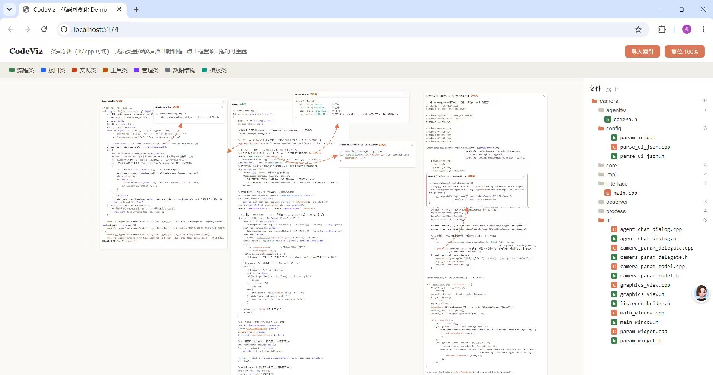
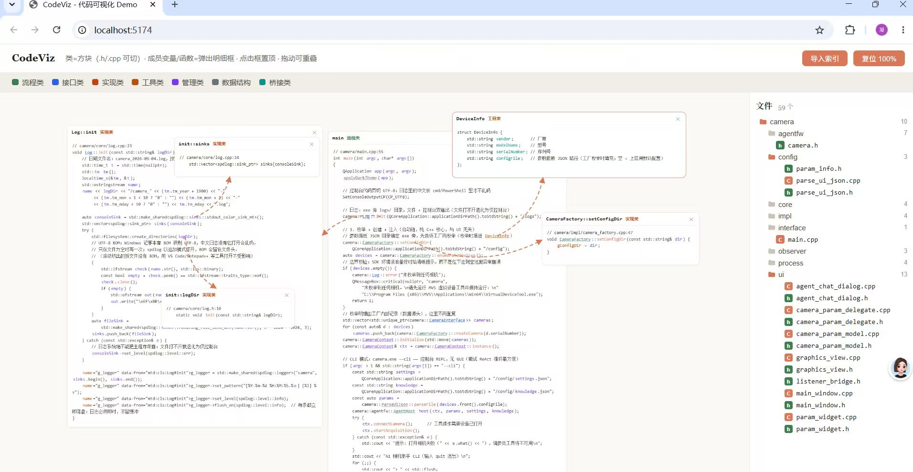
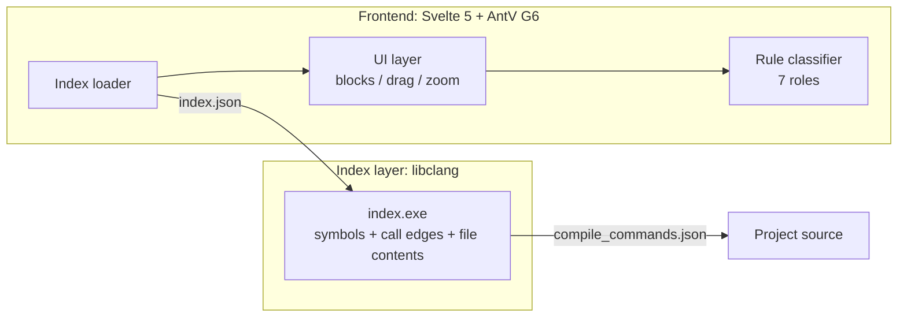

# CodeViz — Interactive C++ Code Visualization

> Turn a codebase into a **clickable, draggable, explorable graph**: every class is a block of real source code, every symbol is a jump target. Powered by **libclang semantic indexing** — no LLM required.



[](LICENSE)
[](https://svelte.dev)
[](https://clang.llvm.org)
[](https://g6.antv.antgroup.com)

## ✨ Features

- **Code blocks as nodes**: each class/function is a block of real source (declaration + implementation), not an abstract bubble
- **True semantic indexing**: libclang-based, with `compile_commands.json` support for full precision (works without it in degraded mode)
- **One-click jumps for 5 symbol kinds**: class names, functions, member variables, globals, and locals/parameters — click to pop a definition box at your cursor
- **Reference lines from the exact token**: arrows start from the precise word you clicked (distinguishes repeated occurrences)
- **Rule-based classifier (zero LLM)**: syntax signals + naming conventions + graph metrics score 7 class roles (flow/interface/impl/utility/manager/data/bridge); low confidence gets a dashed border
- **Main-flow exploration**: expand from the `main` entry, pull up function implementations on demand
- **File tree**: full file list with type icons, click for full content
- **Smooth interactions**: drag to rearrange, click to raise, global wheel zoom (works inside blocks), cascading close
- **Double-click desktop app**: PyInstaller-bundled, zero dependencies for end users (Windows 10/11)

## 📸 Screenshots

| Main view | Symbol jumps |
|---|---|
|  |  |

## 🏗 Architecture



**Data flow**: `index.exe <project-dir>` → `index.json` (all file contents + symbol table + call edges) → click **Open Project** in the UI → graph renders. Frontend and indexer are decoupled by a single JSON file — swapping the indexer (e.g., to clangd) touches nothing else.

## 🛠 Tech Stack

| Layer | Choice | Why |
|---|---|---|
| Frontend | Svelte 5 + Vite 6 | Compile-time framework, zero runtime overhead for graph interaction |
| Graph | AntV G6 5.1 | HTML nodes + SVG overlay arrows |
| Parsing | libclang 18 (Python bindings) | Compiler-grade semantics: overloads, inheritance, call graphs |
| Classification | Pure rule scoring | Syntax + naming + graph metrics, no LLM |
| Packaging | PyInstaller | Launcher + indexer, two exes |

## 🚀 Quick Start

### Development

```bash
npm install
npm run dev        # http://localhost:5173 (ships with a sample index of a camera project)
```

### Desktop

Download `CodeViz.zip` from Releases (~45 MB), unzip, double-click `CodeViz.exe` — the browser opens automatically. No environment required.

### Visualize your own project

Type the project path in the top bar (copy it from Explorer's address bar) and hit **Open Project** — indexing runs locally. Or, CLI-style:

```bash
index.exe <project-dir> index.json
```

then **Import Index** in the UI.

## 🎮 Interactions

| Action | Effect |
|---|---|
| Click colored class name | Open class block (header view, .h/.cpp toggle) |
| Click function name | Pop up that function's implementation |
| Click member / global / local var | Pop up its declaration (teal / amber / indigo) |
| Drag a block | Rearrange (position remembered) |
| Click a block | Raise to top; ✕ closes (cascades to children) |
| Mouse wheel | Global zoom centered on cursor (works inside blocks) |
| File tree (right) | Click a file for full content |

## 📁 Project Layout

```
codeviz/
├── src/
│   ├── App.svelte          # Main UI (graph + interactions + SVG arrows)
│   ├── FileTree.svelte     # File tree component
│   ├── loader.js           # index.json → graph data
│   └── classifier.js       # Rule-based role classifier
├── tools/
│   ├── index.py            # libclang indexer
│   └── serve.py            # Desktop local server (also proxies indexing)
├── public/camera-index.json  # Built-in sample index
└── docs/images/            # Screenshots
```

## 🧠 War Stories (bugs worth sharing)

- **G6 5.1 camera API returns NaN**: `getViewportCenter()` and friends return NaN — coordinate conversion was rewritten to invert the canvas layer's CSS transform matrix instead. What the browser renders is what the matrix says; it cannot lie.
- **Empty member pollution**: `Q_OBJECT` macro expansion yields anonymous fields; an empty string slipped into a regex alternation, inserting empty spans between every character and silently destroying clickability across the whole block.
- **Header-only library leakage**: functions from vendored fmt ended up in the symbol table; `in` matched the substring of `init`. Fixed with word boundaries + definition-location filtering.
- **Coordinate-space hell**: screen/viewport/canvas — three coordinate systems mixing is the #1 trap in visualization tools; all conversions now live in one function.

## ⚠️ Known Limitations

- Macro usage sites not yet clickable (definition sites are) — planned for the clangd-based indexer stage
- Without `compile_commands.json`, call edges may be incomplete (symbol extraction is unaffected)
- Desktop launcher shows a console window (Tauri shell planned)

## 🗺 Roadmap

- [ ] Tauri native shell (no console window, true single exe)
- [ ] Macro call-site jumps (clangd semantic index)
- [ ] Search / filtering, minimap
- [ ] Multi-language support via tree-sitter

## 📄 License

MIT © 2026
